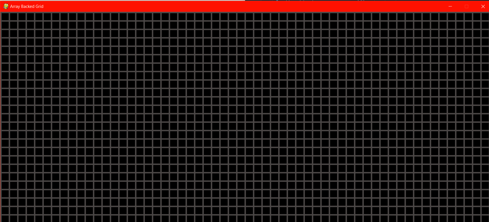
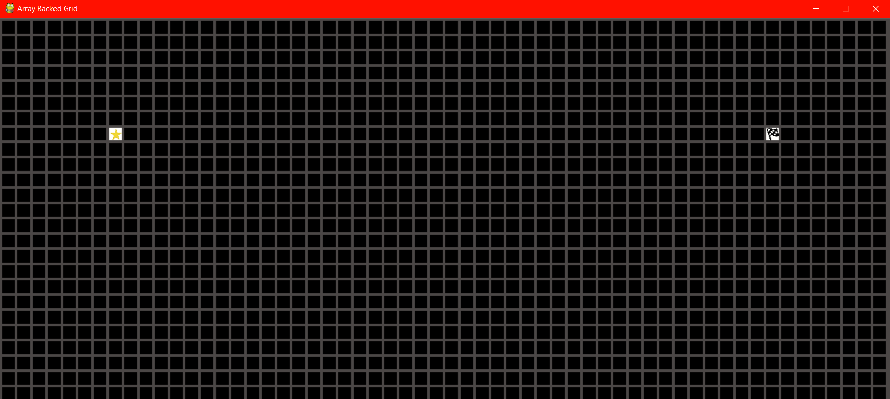
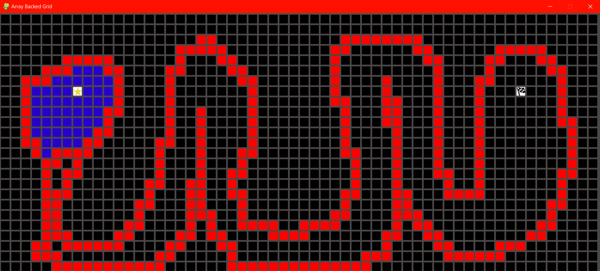
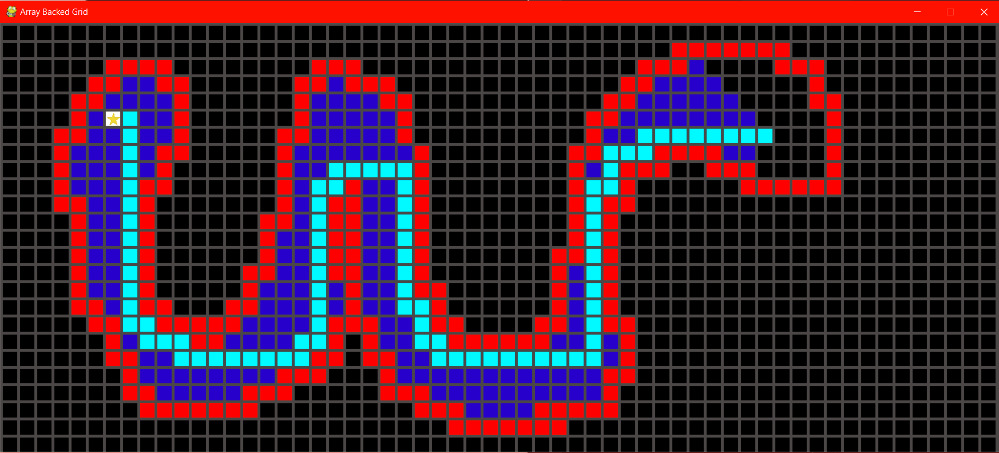

# Path-Finder
A Path Finding visualization using Breadth First Search in a Grid.

1. A simple grid interface made using pygame.

2. Choose the start and end point.

3. Make a wall and see if a path exists or not.

